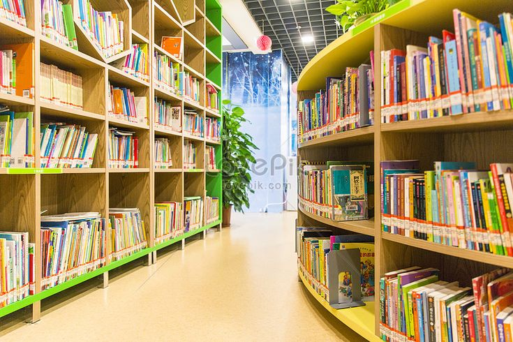

<html>
<html lang="id">
<head>
    <meta charset="UTF-8">
    <meta name="viewport" content="width=device-width, initial-scale=1.0">
    <link href="https://cdn.jsdelivr.net/npm/bootstrap@5.3.0/dist/css/bootstrap.min.css" rel="stylesheet">
    
</head>
	
    <header>
   
   <h1>Perpustakaan Erika Magdalena br Simarmata</h1>
<nav>
<ul>
	 <li><a href="index.html">Beranda</a></li>
         <li><a href="biodata.html">Tentang</a></li>
	 <li><a href="Hubungi Saya.html">Hubungi Saya</a></li>
</ul>
</nav>
</header>
<head>
<title>Hompage Perpustakaan Erika Magdalena br Simarmata</title>
</head>
<body>

Perpustakaan Erika Magdalena br Simarmata ini berisi dokumentasi dari berbagai tugas-tugas
selama semester ini, perpustakaan ini dibuat sebagai arsip yang mungkin dikemudian hari
dapat digunakan kembali.

    

</body>

 

</html>
<h3>Kerja sama perpustakaan lain</h3>
<a href="http://perpus.unsika.ac.id/">Perpustakaan Universitas Singaperbangsa Karawang</a>

<footer>
  
&copy; 2025 All rights reserved

</footer>
 

